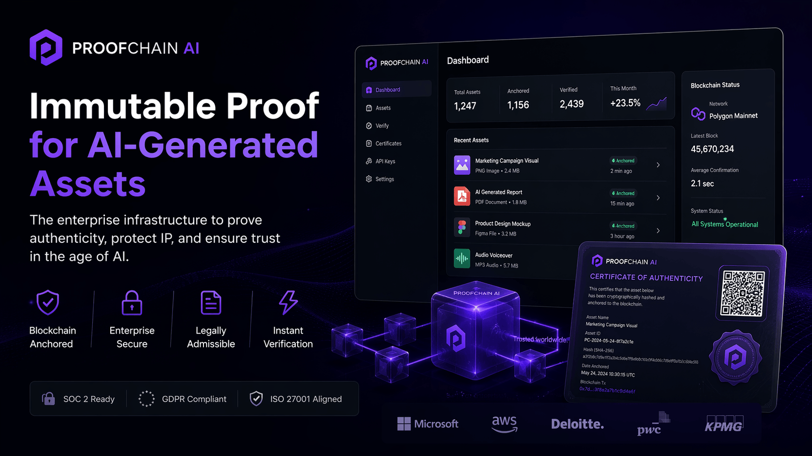

<p align="center">

# ⚡ PROOFCHAIN AI™ ENTERPRISE
<p align="center">
  
</p>
## Private Acquisition Package — $7,500 USD

ProofChain AI™ Enterprise is available as a premium acquisition-ready digital asset.

The package includes source code, smart contracts, landing page, enterprise documentation, product positioning, deployment structure, and commercialization rights.

### Schedule Private Acquisition Call

https://cal.com/ciprian-stefan-plesca
### Immutable Proof Infrastructure for AI-Generated Business Assets

## Included in Acquisition

- Full source code package
- Premium landing page
- Solidity smart contract
- Enterprise dashboard structure
- Supabase database schema
- API route architecture
- PDF certificate engine
- Deployment blueprint
- Enterprise whitepaper
- Monetization strategy
- Commercial positioning
- 30-day post-acquisition support

- ## Availability

This is a private acquisition opportunity.

Repository transfer and full package delivery are available only after private agreement.

Single-buyer transfer can be discussed for exclusive ownership.


</p>

---

<p align="center">

## 🧠 Trust Layer for the AI Economy

ProofChain AI™ enables organizations to generate **tamper-evident, verifiable proof** for digital assets created by artificial intelligence or mission-critical internal workflows.

From legal evidence to IP protection, from media authenticity to compliance operations — ProofChain AI™ creates confidence where trust is required.

</p>

---

# 🚀 Executive Summary

Modern companies are producing high-value digital assets with AI:

- contracts  
- reports  
- source code  
- strategic documents  
- media assets  
- compliance outputs  
- automation workflows  

Yet most organizations **cannot prove**:

❌ when the asset was created  
❌ whether it was altered  
❌ who approved it  
❌ if it existed before a dispute  
❌ if the output is authentic  

## ProofChain AI™ solves this problem.

By combining:

- SHA-256 cryptographic hashing  
- blockchain anchoring  
- timestamp integrity  
- certificate generation  
- public verification infrastructure  

---

# 🏆 Why This Repository Matters

This is **not** a template.

This is a **commercial acquisition-ready digital infrastructure asset** built for:

- founders launching immediately  
- agencies rebranding premium tech  
- legal-tech operators  
- cybersecurity firms  
- SaaS buyers  
- Web3 builders  
- strategic acquirers  

---

# ⚙ Core Capabilities

| Module | Description |
|-------|-------------|
| 🔐 Asset Hashing | SHA-256 integrity fingerprints |
| ⛓ Blockchain Anchoring | Immutable proof on Polygon |
| 🧾 Certificate Engine | Professional downloadable proof certificates |
| 🌐 Public Verification | Verify assets via public link |
| 📊 Dashboard System | Asset lifecycle management |
| 🛡 Audit Logs | Operational traceability |
| 💳 Monetization Ready | Commercial launch structure |
| 🎯 Premium Landing Page | Conversion-grade presentation |

---

# 🧱 Technology Stack

```txt
Frontend      → Next.js + TypeScript + Tailwind
Backend       → Node.js + API Routes
Database      → Supabase PostgreSQL
Storage       → Supabase Secure Storage
Blockchain    → Solidity + Hardhat + Polygon
Payments      → Stripe Ready
Certificates  → PDF Engine
Deployment    → Vercel Ready

🧠 Strategic Use Cases
Legal Evidence Infrastructure

Prove documents existed before disputes.

AI Governance

Track and validate AI-generated assets.

IP Protection

Timestamp creative or technical output.

Enterprise Compliance

Generate verifiable records for internal workflows.

Media Authenticity

Validate original source material.

💎 Commercial Value

Building this internally often requires:

300+ engineering hours
blockchain expertise
UI/UX design
infrastructure architecture
compliance strategy
commercialization planning
ProofChain AI™ compresses that timeline instantly.
📈 Buyer Positioning

Ideal for:

AI agencies
Web3 consultancies
cybersecurity operators
legal-tech founders
startup studios
M&A digital asset buyers
🛰 Repository Structure
/apps/web            → product platform
/apps/contracts      → smart contracts
/supabase            → schema & migrations
/docs                → GTM / product / security docs
/assets              → branding materials

🔒 Ownership Notice
This repository and all associated materials constitute proprietary intellectual property.
Unauthorized use, redistribution, resale, cloning, sublicensing, or derivative commercialization is strictly prohibited.

⚖ License
© 2026 Ciprian Stefan PlescaAll Rights Reserved.
Use permitted only through explicit written agreement.

📞 Private Acquisition / Licensing

Schedule a Private Discussion
https://cal.com/ciprian-stefan-plesca


🧨 Final Statement

If your AI created it, can you prove it?

ProofChain AI™ can.


© 2026 Ciprian Stefan Plesca — All Rights Reserved

```
